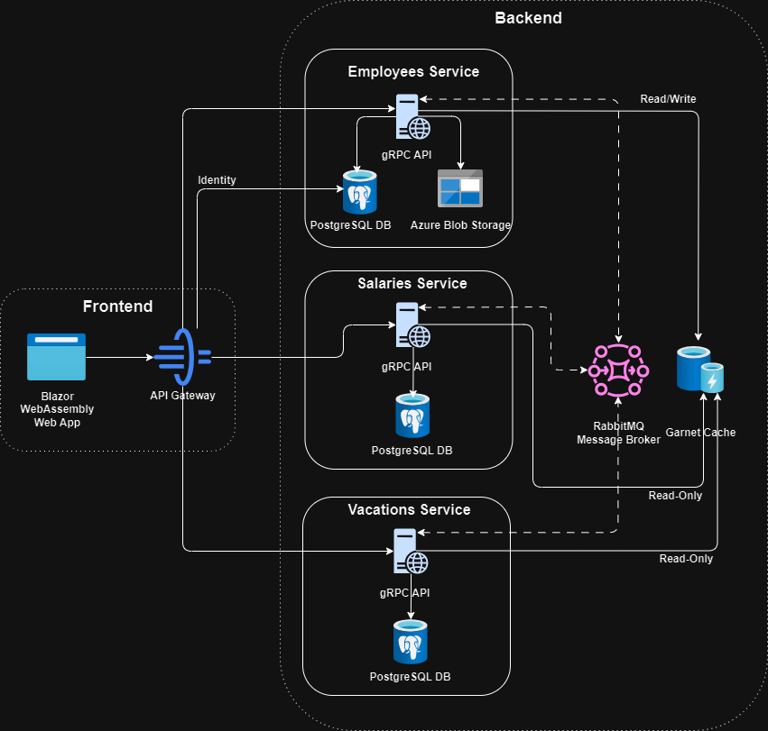
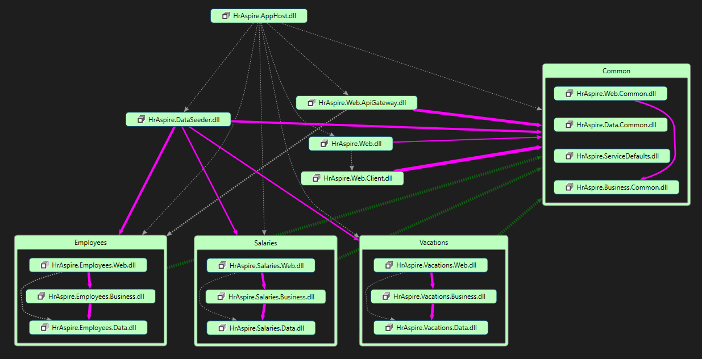

# HrAspire

HrAspire is a simple but resilient, observable, cloud ready distributed HR system. It is built with [.NET Aspire](https://learn.microsoft.com/en-us/dotnet/aspire/) - Microsoft's new framework for building observable, production ready, distributed applications.

HrAspire is a project that I built in my spare time with a couple of key goals in mind:
- learn [.NET Aspire](https://learn.microsoft.com/en-us/dotnet/aspire/) and try out various [integrations](https://learn.microsoft.com/en-us/dotnet/aspire/fundamentals/integrations-overview)
- explore and deepen my knowledge of technologies like [PostgreSQL](https://www.postgresql.org/), [RabbitMQ](https://www.rabbitmq.com/), [Garnet](https://microsoft.github.io/garnet/docs), [ASP.NET Core Minimal APIs](https://learn.microsoft.com/en-us/aspnet/core/fundamentals/minimal-apis/overview), [gRPC](https://grpc.io/), which I know about but haven't used in projects at work or in other side projects
- explore and deepen my knowledge of libraries like [MassTransit](https://masstransit.io/), [FluentValidation](https://docs.fluentvalidation.net/), [Mapperly](https://mapperly.riok.app/), which I know about but haven't used in projects at work or in other side projects
- practice my system design skills
- have fun architecting and coding!

## Functionalities
HrAspire is a simple HR system designed to streamline employee management. The system offers role-based functionality for Employees, Managers and HR Managers, enabling efficient handling of common HR tasks. 

### Employee functionalities
All app users are employees including users in Manager and HR Manager roles. Employees can:
- log in
- view own employee details - email, full name, date of birth, position, department, manager, salary, used paid vacation days, etc.
- view and create/update/delete vacation requests for paid or unpaid leaves
- change password
- log out

### Manager functionalities
Managers have all the capabilities of an employee plus additional management features:
- view all managed employees
- access details of all managed employees
- view and create/update/delete documents for managed employees
- view and create/update/delete salary (change) requests for managed employees
- view and approve/reject vacation requests for managed employees

### HR Manager functionalities
HR managers have all the capabilities of an employee plus additional HR-specific management features:
- view and create/update/delete employees
- access details of all employees
- view and create/update/delete documents for all employees
- view and approve/reject salary (change) requests for all employees
- view vacation requests for all employees

## Architecture
HrAspire is built using the [microservice architecture](https://en.wikipedia.org/wiki/Microservices), with multiple (micro)services handling different aspects of HR management and architectural concerns. These services can be divided into 2 groups: frontend and backend. Frontend services are designed to be Internet-facing and backend services are designed to be accessible only within a protected internal network. In addition to these services, a [data seeder console app](/HrAspire.DataSeeder) has been implemented to provide a quickstart experience for development environment.

### Frontend
- The UI of the system is a web-based [single-page app](/HrAspire.Web.Client) built with [Blazor WebAssembly](https://dotnet.microsoft.com/en-us/apps/aspnet/web-apps/blazor) and hosted by an [ASP.NET Core server](/HrAspire.Web).
- The [API Gateway](/HrAspire.Web.ApiGateway) exposes the functionalities of all backend services to the web app through an [HTTP-based API](/HrAspire.Web.ApiGateway/Endpoints). It also handles cross-cutting concerns like authentication, authorization, account management and input data validation.

### Backend
- The [Employees service](/Employees) is the microservice responsible for managing employees and their documents. It's built using the 3-tier architecture. The main data storage is a PostgreSQL database but document files are stored in [Azure Blob Storage](https://azure.microsoft.com/en-us/products/storage/blobs) containers. It exposes employee and document operations through a [gRPC-based API](/Employees/HrAspire.Employees.Web/Services). The service is also asynchronously communicating with the other backend services by producing and consuming RabbitMQ messages and is reading and writing specific employee info in a shared Garnet cache.
- The [Salaries service](/Salaries) is the microservice responsible for managing salary requests. It's built using the 3-tier architecture. The data is stored in a PostgreSQL database. It exposes salary request operations through a [gRPC-based API](/Salaries/HrAspire.Salaries.Web/Services). The service is also asynchronously communicating with the [Employees service](/Employees) by producing and consuming RabbitMQ messages and is reading specific employee info from the shared Garnet cache.
- The [Vacations service](/Vacations) is the microservice responsible for managing vacation requests. It's built using the 3-tier architecture. The data is stored in a PostgreSQL database. It exposes vacation request operations through a [gRPC-based API](/Vacations/HrAspire.Vacations.Web/Services). The service is also asynchronously communicating with the [Employees service](/Employees) by producing and consuming RabbitMQ messages and is reading specific employee info from the shared Garnet cache.

Architecture diagram:

Solution projects diagram:

